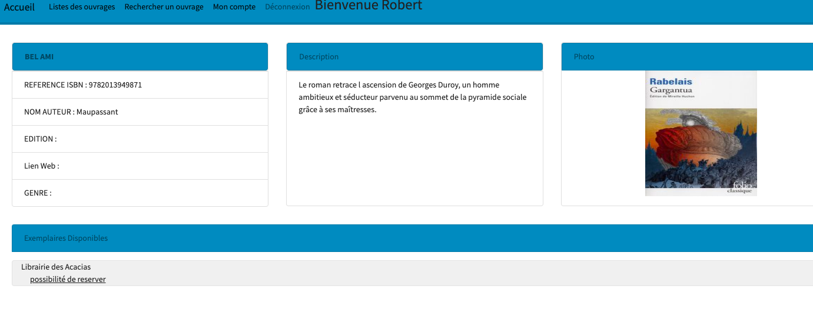
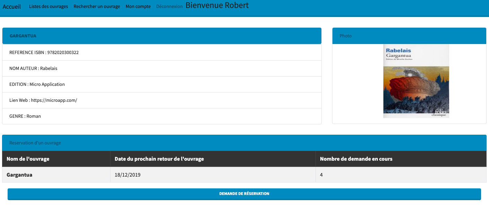
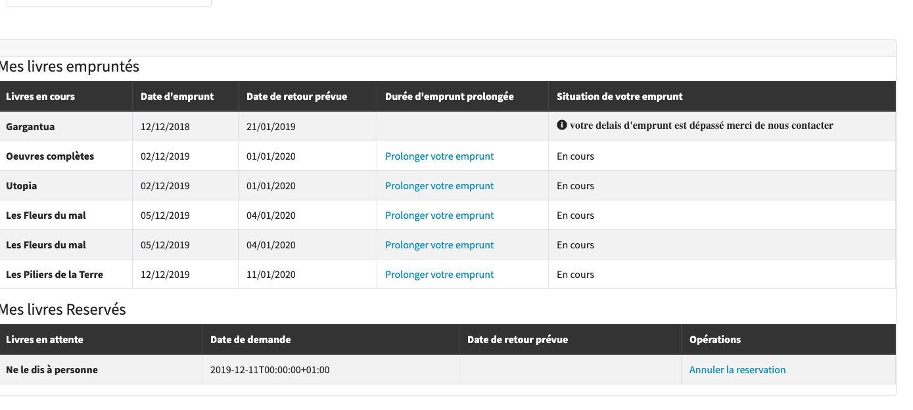
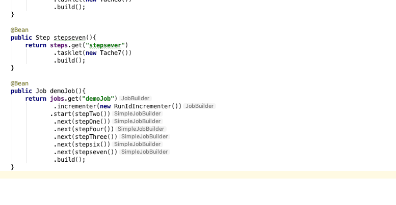
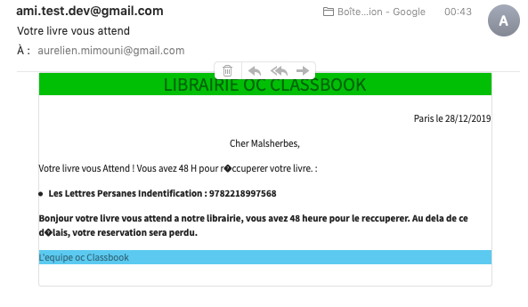
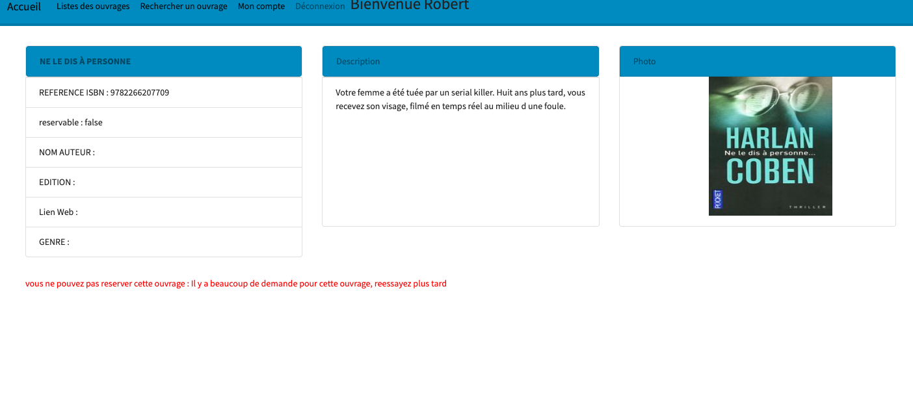
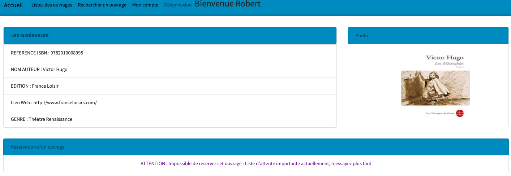

||__TICKET 1 - Evolution du systeme de librairie__
|:-------------------:|:-------------------:|

 |Ajoutez un système de réservation d’ouvrages .|
 | :------------: |
  

Diagnostique :
-------------------

Nous souhaiterions mettre en place un système de réservation de livres pour les usagers.

Attendu :
-------------------

Avec le système de reservation  : 

Tous les types d’ouvrages peuvent être réservés.

La liste de réservation ne peut comporter qu’un maximum de personnes correspondant à 2x le nombre d’exemplaires de l’ouvrage.

Il n’est pas possible pour un usager de réserver un ouvrage qu’il a déjà en cours d’emprunt

Quand un usager emprunte le livre réservé ou si le délai de 48h après la notification est dépassé, sa réservation est supprimée de la liste et le processus recommence pour l’usage suivant dans la liste

Evolutions prévues :

| Description         |     Processus  |       Affichage |
| :------------: | :-------------: | :-------------: |
|Le lecteur interroge tous les ouvrages       |   <ul> Le lecteur choisit l'ouvrage qu'il souhaite emprunter</ul><ul>Il est informé que celui ci n'est pas disponible mais peut etre reserver</ul>    |         |
| Le lecteur est informé du nombre de lecteur en attente de l'ouvrage et date la plus proche de retour   |   <ul>il effectue la reservation de l'ouvrage</ul>  |       |
| Le lecteur consultre son profil est voit ses livres en cours de reservation   |   <ul>Il a la possibilité de l'annuler</ul>  |       |
| un traitement batch est réalisé       |    mise a jour des status  par le module batchlibrairie |<ul>Le lecteur recoit un mail lui indiquant que son ouvrage l'attend|

Cas d'exception :
----------------

 Description         |     Processus  |       Affichage |
| :------------: | :-------------: | :-------------: |
|Le lecteur a le livre en cours d'emprunt       |   <ul> Il ne peut donc le reserver comme indiqué dans les regles de gestion</ul>  |         |
| la file d'attente est trop importante l'ouvrage ne peut etre reservé   |   <ul>il doit revenir en arriere pour valider une autre reservation</ul>  |       |

  
  
  

