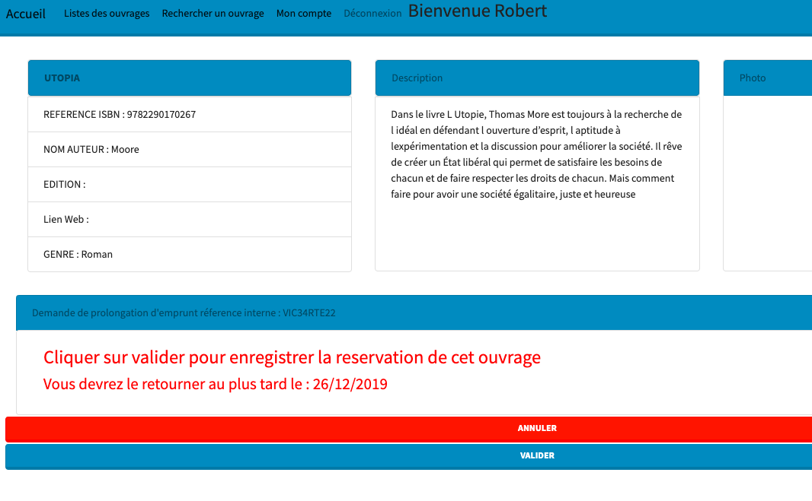
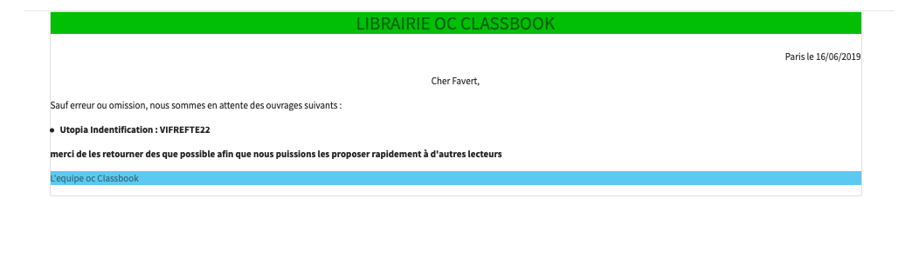
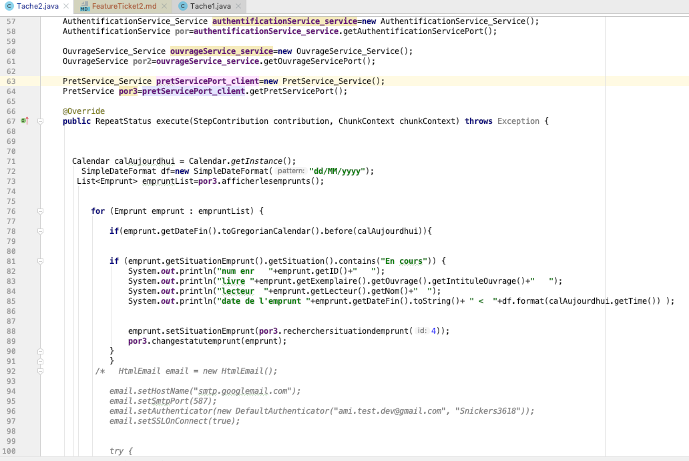
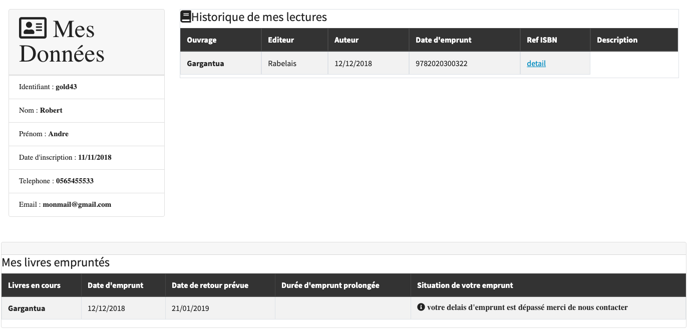

||__TICKET 2 - Gestion de bugs prioritaire__
|:-------------------:|:-------------------:|

 |Problème de prolongation sur ouvrage non rendu .|
 | :------------: |
  

Diagnostique :
-------------------

Il est apparut que certains lecteurs prolongent leur delais d'obtention alors que celui-ci est dépassé.

Conséquence :
-------------------

Avec le système de reservation  : certains usagers se deplacent pour reccuperer le livre qui n'est pas disponible.

Evolutions prévues :

__Préambule__ 
-------------------
Dans le cadre de la mise en place du systeme de gestion bibliothèque,
nous avions anticipé la problématique et __nous avions donc pris la décision de ne pas permettre 
au lecteur ayant un emprunt en retard de pouvoir prolonger__ lorsque celui-ci est dépassé.
voici le détail de fonctionnement.

| Description         |     Processus  |       Affichage |
| :------------: | :-------------: | :-------------: |
|Le lecteur emprunte un ouvrage       |   <ul> Le lecteur choisit l'exemplaire qu'il souhaite emprunter</ul><ul>Il est informé de sa date de retour prévue</ul>    |         |
| Le lecteur a dépassé son délais d'emprunt   |   <ul>Il recoit un mail lui indiquant que son livre n'a pas été receptionné à temps</ul><ul>ce mail lui indique la liste de tous les ouvrages en sa possession</ul>  |       |
| **Le lecteur ne peut plus prolonger son emprunt**        |    Cette mise a jour de statut est réalisée par le module batchlibrairie |<ul>Le lecteur n'a pas la possibilité de renouveler son emprunt comme initialement|

  
  
  

