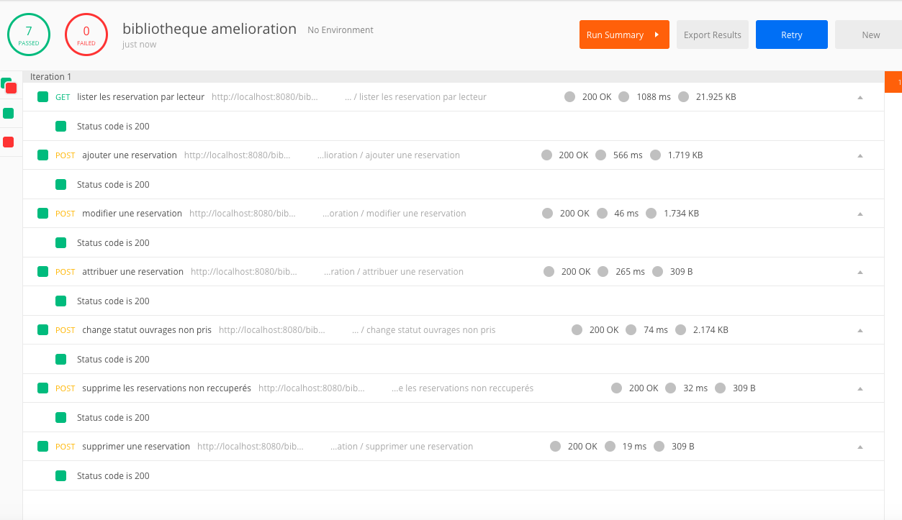
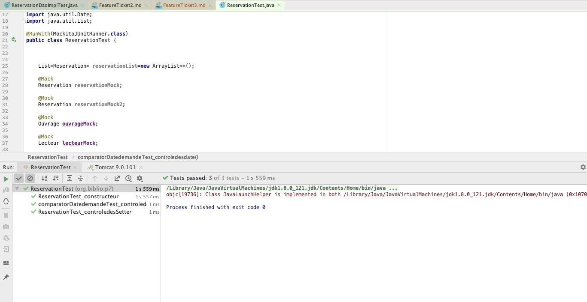
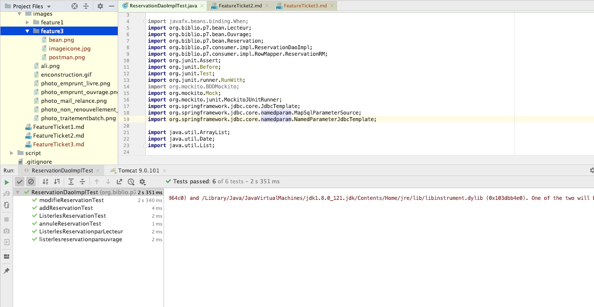

||__TICKET 3 - Gestion des tests unitaires/integration__
|:-------------------:|:-------------------:|

 |Objectif : Fiabiliser les evolutions. controle qualité de code|
 | :------------: |
  

Diagnostique :
-------------------

Suite a la modification menée sur l'application bibliothèque, nous testons nos données et nos différentes méthode afin d'évaluer 
leur bon fonctionnement.

Conséquence :
-------------------

Avec le système de reservation  : il nous faut vérifier que la qualité du code soit conforme avec la premiere partie livré.

Afin d'analyser notre code, 
nous avons effectué un controle sur l'ensemble des classes menant a la reservation.
Ces tests se décomposent de la manière suivante : 

Controle unitaire : 
- couche modèle : teste les entrées et sortie du code, constructeur, getter setter afin de parer a tout changement sur notre objet.
- couche consummer : nous testons l'ensemble des methodes en lien avec notre base de donnée, toutefois en imitant les comportements de nos données ( stub ),
-couche business : nous testions les methodes métiers permettant par exemple d'attribuer en priorité un ouvrage, d'annuler un livre non reclamer etc.. 

Controle Integration :
- utilisation postman 
L'objectif etant de tester les méthode d'integration de la bd et de voir leur comportement.

| Description         |     Processus  |       Affichage |
| :------------: | :-------------: | :-------------: |
|Test d'intégration |   <ul>Nous utilisons deux utilitaires afin d'effectuer nos tests unitaires </ul><ul>Postman https://www.getpostman.com/</ul> <ul>widzler qui permet directment via google chrome d'extraire la methode au format pour la transferer dans postman</ul>   |         |
| Test Unitaire    |   <ul>test des beans </ul> |       |
|      |    Test de la couche consumer en complement du test d'integration  ||
|      |    Test de la couche business! ||

  
  
  

